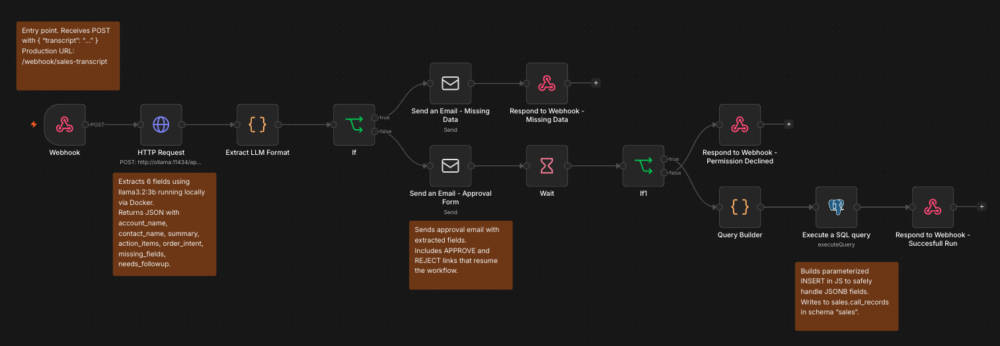

# Bell & McCoy — Sales Call Automation

This project automates the processing of sales call transcripts. A transcript comes in, an AI model extracts the key information, a human reviews and approves it, and the record gets saved to a database — all without manual data entry.

## How it works

A sales call transcript is submitted to the system. A local AI model (`llama3.2:3b`) reads it and pulls out the relevant fields: company name, contact, summary, action items, and order intent. If the extraction looks good, the reviewer gets an email with an Approve or Reject button. Approved records are saved to PostgreSQL automatically.

## Runs entirely on your machine

To avoid paid subscriptions during this trial, everything runs locally via Docker — the workflow engine (n8n), the AI model (Ollama), and the database (PostgreSQL). No external APIs, no cloud accounts needed.

Migrating to a cloud setup when ready is straightforward: swap Ollama for any hosted model API (OpenAI, Anthropic, etc.) and point the database to a managed PostgreSQL instance. The workflow logic stays the same.

## Demo

Watch a walkthrough of the system here: [YouTube — Bell & McCoy Sales Automation Demo](https://youtu.be/hCnpcf5s9Zk)

_(Sorry for not using Loom — I ran into issues with that software on my computer.)_

## Workflow overview

## AI model

Transcript extraction is handled by [`llama3.2:3b`](https://ollama.com/library/llama3.2:3b) running locally via Ollama. No external API keys required.

## Documentation

- [Setup guide](docs/technical.md) — how to run the project, configure credentials, and test it
- [Project structure](docs/project-structure.md) — what every file in this repo does, including the Postman collection
